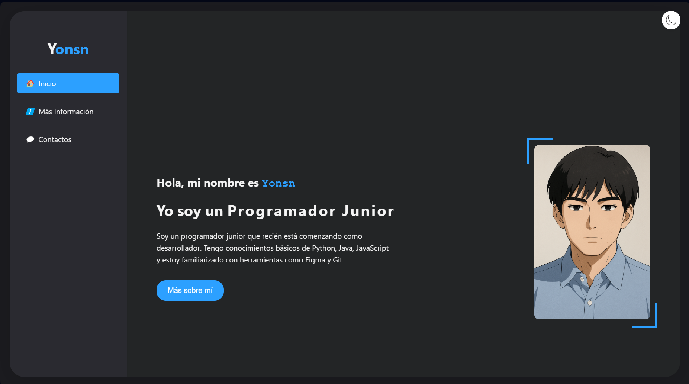
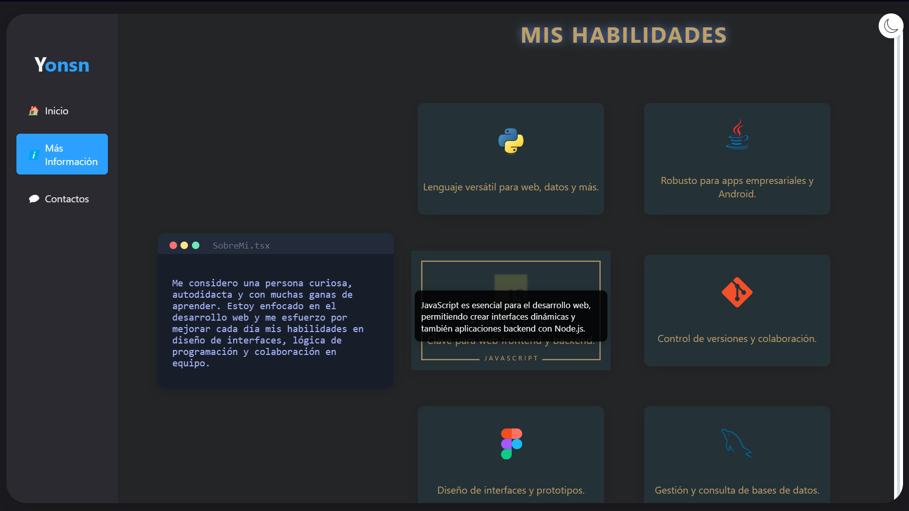
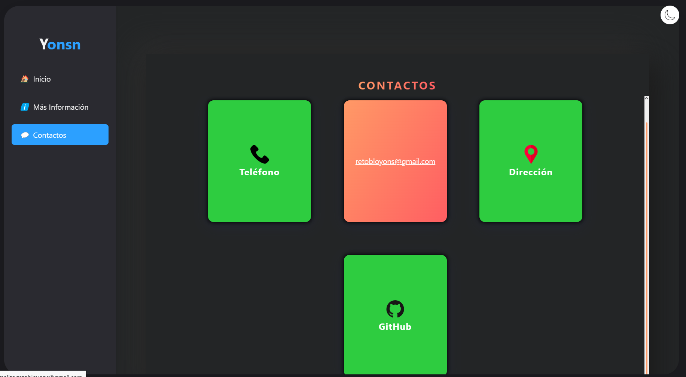

# Portafolio Web

Este es un portafolio personal desarrollado en HTML, CSS y JavaScript. El sitio cuenta con un diseño moderno, responsivo y animaciones suaves.

## Secciones principales

### 🏠 Inicio
Página principal de bienvenida y presentación.

---

### ℹ️ Más Información
Sección donde se muestra información adicional sobre ti, tus habilidades y experiencia.

---

### 💬 Contacto
Aquí puedes encontrar diferentes formas de contactarte: teléfono, email, dirección y GitHub. Las tarjetas de contacto tienen animaciones interactivas y cambian de color según el modo claro/oscuro.

## Características
- Diseño responsivo
- Modo claro y oscuro
- Animaciones con GSAP
- Tarjetas de contacto con efecto flip

---

### ¿Cómo ver el portafolio?
Abre el archivo `index.html` en tu navegador favorito.

---

